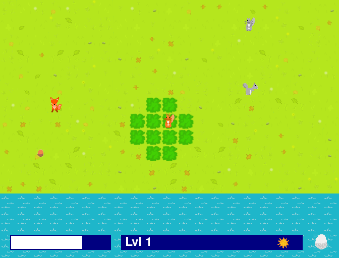
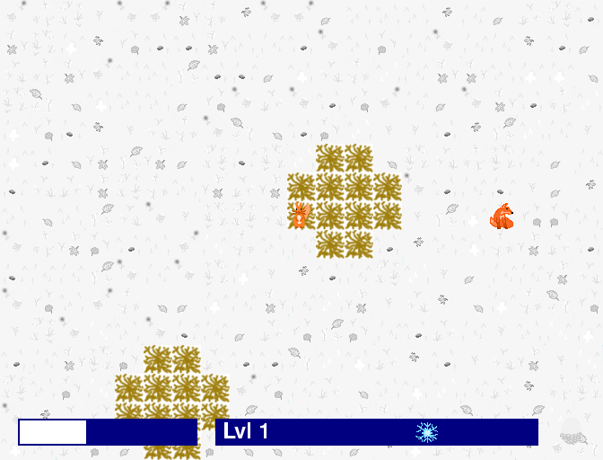

get dem nuts
============

"get dem nuts" is a squirrel-based survival game. You, an endangered red squirrel, must gather and eat nuts, evade foxes, compete with grey squirrels, and survive winter!

Controls
--------

| Key(s)      | Action                   |
| ----------- | ------------------------ |
| WASD        | Movement                 |
| E           | Rotate clockwise         |
| Q           | Rotate counter-clockwise |
| Space       | Eat nut                  |
| C           | Pick up / bury nut       |
| F           | Scrabble ground          |
| Escape      | Quit game                |

Hints
-----

* You need to keep your energy up.
* Squirrels are safe in trees.
* Buried nuts last longer but attract foxes.

Screenshots
-----------

About
-----

This game is a prototype built very hastily for [GitHub Game Off 2019](https://itch.io/jam/game-off-2019).

Source code can be found on [GitHub](https://github.com/peterdn/get-dem-nuts/).